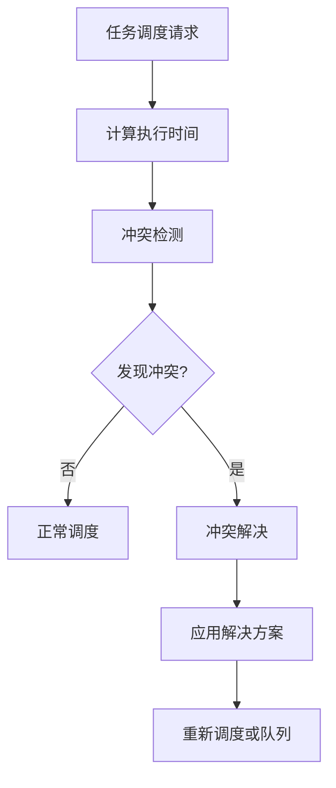
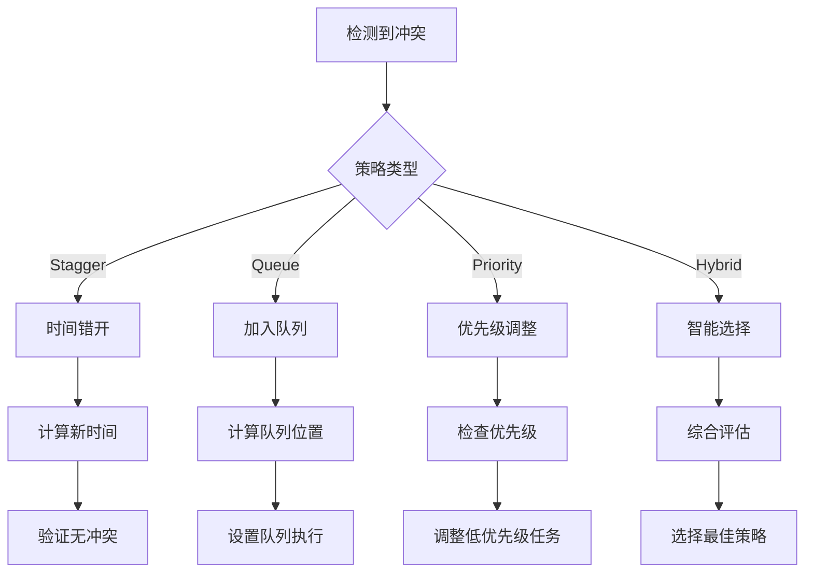

# 定时任务冲突解决系统

## 概述

定时任务冲突解决系统是一个智能的任务调度增强功能，专门用于检测和解决定时任务的并发冲突问题。当多个任务被安排在相同或接近的时间执行时，系统会自动检测冲突并采用适当的策略进行解决。

## 核心组件

### 1. ConflictDetector (冲突检测器)

负责检测任务调度时的各种冲突类型：

- **时间冲突**: 多个任务在相同时间窗口内执行
- **资源冲突**: 相同类型的任务可能竞争相同资源
- **优先级冲突**: 高优先级任务与低优先级任务时间接近

#### 配置选项

```typescript
conflictDetection: {
  enabled: boolean;              // 启用冲突检测
  conflictWindowMs: number;      // 冲突检测时间窗口（毫秒）
  maxAdjustments: number;        // 最大调整次数
  adjustmentIntervalMs: number;  // 调整间隔（毫秒）
  strictMode: boolean;           // 严格模式
  considerPriority: boolean;     // 考虑任务优先级
  considerTaskType: boolean;     // 考虑任务类型
}
```

### 2. ConflictResolver (冲突解决器)

提供多种策略来解决检测到的冲突：

#### 解决策略

1. **时间错开策略 (Stagger)**
   - 自动调整冲突任务的执行时间
   - 支持向前或向后调整
   - 可配置调整间隔和最大尝试次数

2. **队列策略 (Queue)**
   - 将冲突任务加入执行队列
   - 按优先级顺序执行
   - 支持队列位置计算

3. **优先级策略 (Priority)**
   - 高优先级任务保持原时间
   - 低优先级任务自动调整
   - 基于权重系统

4. **混合策略 (Hybrid)**
   - 根据冲突情况自动选择最佳策略
   - 综合考虑优先级、冲突数量和严重程度

#### 配置选项

```typescript
conflictResolution: {
  enabled: boolean;
  defaultStrategy: 'stagger' | 'queue' | 'priority' | 'hybrid';
  staggerIntervalMs: number;     // 错开时间间隔
  maxStaggerAttempts: number;    // 最大错开尝试次数
  queueEnabled: boolean;         // 是否启用队列策略
  priorityWeights: Record<string, number>; // 优先级权重
  adaptiveAdjustment: boolean;   // 自适应调整
}
```

## 工作流程

### 1. 任务调度时的冲突检测



### 2. 冲突解决决策树



## 使用方法

### 1. 基本配置

```typescript
import { advancedConfigManager } from '@/lib/task-scheduler-config';

// 启用冲突检测和解决
advancedConfigManager.updateConfig({
  conflictDetection: {
    enabled: true,
    conflictWindowMs: 60000,  // 1分钟检测窗口
    strictMode: false,
    considerPriority: true,
    considerTaskType: true
  },
  conflictResolution: {
    enabled: true,
    defaultStrategy: 'hybrid',
    staggerIntervalMs: 30000,  // 30秒错开间隔
    maxStaggerAttempts: 5,
    queueEnabled: true
  }
});
```

### 2. 任务优先级设置

```typescript
const task: ScheduledTask = {
  id: 'important_task',
  name: '重要任务',
  type: 'daily',
  enabled: true,
  metadata: {
    priority: 'high'  // urgent, high, normal, low
  },
  schedule: {
    type: 'daily',
    hour: 9,
    minute: 0
  }
};
```

### 3. 监控冲突状态

```typescript
import { taskScheduler } from '@/lib/scheduler';

// 获取冲突统计
const stats = taskScheduler.getConflictStats();
console.log('冲突检测统计:', stats.detector);
console.log('冲突解决统计:', stats.resolver);

// 清理过期数据
taskScheduler.cleanupConflictData();
```

## 配置建议

### 1. 时间窗口设置

- **小型系统**: 30-60秒检测窗口
- **中型系统**: 60-120秒检测窗口
- **大型系统**: 120-300秒检测窗口

### 2. 解决策略选择

- **少量任务**: 使用时间错开策略
- **中等任务量**: 使用混合策略
- **大量任务**: 使用队列策略

### 3. 优先级权重

```typescript
priorityWeights: {
  'urgent': 4,   // 紧急任务
  'high': 3,     // 高优先级
  'normal': 2,   // 普通优先级
  'low': 1       // 低优先级
}
```

## 性能影响

### 1. 检测开销

- 冲突检测在任务调度时进行，不影响执行性能
- 时间复杂度: O(n)，其中n为已调度任务数量
- 内存开销: 每个任务约50-100字节

### 2. 解决开销

- 时间错开策略: 几乎无开销
- 队列策略: 轻微延迟，但提高整体吞吐量
- 优先级策略: 中等开销，需要重新计算

## 故障排除

### 1. 常见问题

**问题**: 冲突检测不工作
**解决**: 检查 `conflictDetection.enabled` 是否为 true

**问题**: 任务时间调整过于频繁
**解决**: 增大 `conflictWindowMs` 或减少 `maxStaggerAttempts`

**问题**: 队列任务执行延迟过长
**解决**: 启用 `adaptiveAdjustment` 或调整优先级权重

### 2. 调试方法

```typescript
// 启用详细日志
advancedConfigManager.updateConfig({
  monitoring: {
    enableDetailedLogs: true,
    conflictReporting: true
  }
});

// 查看冲突历史
const resolutionHistory = taskScheduler.getConflictStats().resolver;
console.log('解决历史:', resolutionHistory);
```

## 最佳实践

1. **合理设置优先级**: 避免过多高优先级任务
2. **分散任务时间**: 尽量避免在整点时间集中调度
3. **定期清理数据**: 使用 `cleanupConflictData()` 清理过期数据
4. **监控系统状态**: 定期检查冲突统计和解决成功率
5. **渐进式配置**: 从保守配置开始，逐步优化参数

## API 参考

### ConflictDetector

```typescript
class ConflictDetector {
  detectConflicts(task: ScheduledTask, targetTime: Date): ConflictInfo[]
  registerScheduledTask(task: ScheduledTask, scheduledTime: Date): void
  unregisterTask(taskId: string): void
  cleanupExpiredTasks(): void
  getConflictStats(): ConflictStats
}
```

### ConflictResolver

```typescript
class ConflictResolver {
  resolveConflicts(task: ScheduledTask, targetTime: Date, conflicts: ConflictInfo[]): Resolution | null
  getResolutionHistory(): Resolution[]
  getResolutionStats(): ResolutionStats
  clearResolutionHistory(): void
}
```

### TaskScheduler 增强方法

```typescript
class TaskScheduler {
  getConflictStats(): { detector: ConflictStats; resolver: ResolutionStats }
  updateConflictConfig(config: Partial<ConflictConfig>): void
  cleanupConflictData(): void
}
```
